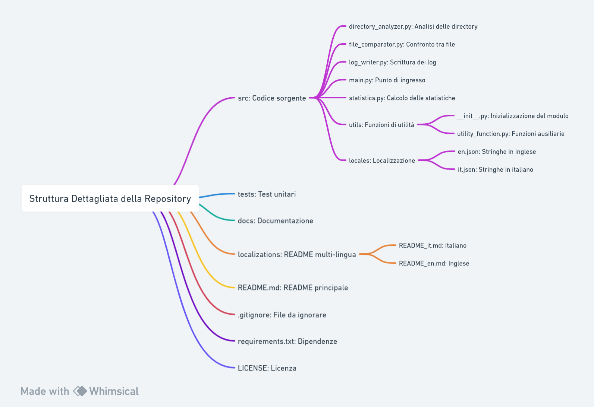

# Progetto: Analizzatore di Differenze tra Cartelle

## Obiettivi

L'obiettivo principale è sviluppare uno strumento in Python che permetta agli utenti di analizzare e confrontare le strutture di file di due cartelle specificate. Lo strumento eseguirà una scansione ricorsiva delle cartelle e dei file, e fornirà un dettagliato resoconto delle differenze tra i file corrispondenti, insieme a statistiche e metadati relativi all'operazione.

---

## Funzionalità

1. **Selezione delle Cartelle**: L'utente fornirà i percorsi delle cartelle da confrontare.
2. **Analisi Ricorsiva**: Lo strumento eseguirà una scansione ricorsiva delle cartelle e delle sottocartelle.
3. **Confronto dei File**: Saranno confrontati i file corrispondenti nelle due strutture.
4. **File di Log**: Generazione di file di log dettagliati contenuti in una cartella dedicata.
5. **Statistiche**: Saranno fornite statistiche aggregate relative alle differenze tra i file.
6. **Metadati dell'Esecuzione**: Dettagli come data, ora e percorsi delle cartelle confrontate saranno inclusi.

---

## Strumenti Utilizzati

- **Python**: Il linguaggio di programmazione principale, scelto per la sua leggibilità, modularità e ampia libreria standard.
- **Git**: Per il controllo delle versioni e la collaborazione.
- **Framework di Test Unitari**: Per scrivere ed eseguire test unitari.

---

## Struttura del Progetto e Giustificazioni

Nel mondo dello sviluppo software, la struttura di una repository GitHub è fondamentale per garantire un flusso di lavoro efficiente, una manutenzione agevole e una collaborazione efficace tra gli sviluppatori. Una struttura ben organizzata è particolarmente cruciale per i progetti di grandi dimensioni, ma anche i progetti più piccoli possono beneficiare enormemente di una struttura chiara e logica.

La struttura della repository che stiamo per esaminare è stata progettata seguendo le "best practices" comuni nell'ecosistema Python e tenendo conto di vari aspetti chiave come la modularità, la scalabilità e la manutenibilità. Ogni componente è stato posizionato in modo da avere un ruolo specifico, permettendo così una separazione chiara delle responsabilità e rendendo il progetto più facile da gestire e estendere.

Nella spiegazione dettagliata che segue, esploreremo ciascun componente della repository, il suo ruolo e le ragioni della sua posizione all'interno della struttura. Questo ti fornirà una visione completa che ti aiuterà non solo a navigare nel progetto attuale, ma anche a prendere decisioni informate su come strutturare i tuoi futuri progetti GitHub.



### Dettagli sui Componenti e le loro Funzioni

#### src/: Codice sorgente

- **directory_analyzer.py**: Si occupa della scansione e del filtraggio delle directory.
- **file_comparator.py**: Responsabile dell'hashing e del confronto tra file.
- **log_writer.py**: Gestisce il logging e la formattazione dei log.
- **main.py**: Punto di ingresso del programma, si occupa dell'inizializzazione e dell'esecuzione.
- **statistics.py**: Esegue analisi e genera report statistici.
- **utils/**: Contiene funzioni di utilità per conversioni e validazioni.

#### locales/: Contiene i file per la localizzazione in diverse lingue.

#### tests/: Test unitari

- Copertura del codice e verifica delle funzionalità.

#### docs/: Documentazione

- Guida per l'utente e documentazione delle API.

#### localizations/: README multi-lingua

- Versioni del README in diverse lingue.

#### README.md: README principale

- Fornisce un'overview del progetto e istruzioni per l'installazione.

#### .gitignore: File da ignorare

- Ignora file temporanei e build.

#### requirements.txt: Dipendenze

- Elenco delle librerie e delle loro versioni.

#### LICENSE: Licenza

- Termini e condizioni sotto cui il software può essere utilizzato.

### Perché questa Suddivisione?

- **Modularità**: Ogni componente ha un ruolo specifico ed è isolato in un modulo separato per facilitare la manutenzione e il testing.
- **Separazione delle Preoccupazioni**: La suddivisione aiuta a mantenere una separazione chiara tra logica, dati e presentazione.
- **Manutenibilità**: Una struttura ben organizzata facilita la manutenzione e il debugging.
- **Riusabilità**: I moduli possono essere facilmente riutilizzati in altri progetti o contesti.
- **Collaborazione**: Una struttura modularizzata facilita la collaborazione tra sviluppatori.
- **Scalabilità**: Aggiungere nuove funzionalità è più facile con una struttura modulare.

---

Con questo approccio, il progetto sarà ben organizzato e facilmente estendibile, permettendo una manutenzione e un'aggiunta di nuove funzionalità più agevoli nel tempo.

## File di Requisiti

Il progetto utilizza diversi file di requisiti per gestire le dipendenze in vari ambienti:

1. **requirements.txt**: Contiene le dipendenze necessarie per l'ambiente di produzione.
2. **requirements-dev.txt**: Contiene le dipendenze necessarie per l'ambiente di sviluppo. Include tutte le dipendenze di `requirements.txt`.
3. **requirements-test.txt**: Contiene le dipendenze necessarie per eseguire i test. Include tutte le dipendenze di `requirements.txt`.
4. **requirements-all.txt**: Contiene una combinazione di tutte le dipendenze sopra elencate. Utilizzato per l'installazione locale quando si eseguono sia sviluppo che test.

### Utilizzo

Per installare le dipendenze da un file di requisiti specifico, eseguire:

```bash
pip install -r NOME_DEL_FILE.txt
```

### Rationale per Questo Approccio

L'uso di file di requisiti separati offre diversi vantaggi:

- **Isolamento delle Dipendenze**: Facilita la gestione delle dipendenze specifiche per ogni ambiente.
- **Ottimizzazione CI/CD**: Permette di specificare quale file di requisiti utilizzare in diversi stage del pipeline CI/CD.
- **Sicurezza**: Riduce la superficie di attacco installando solo le dipendenze necessarie in produzione.
- **Manutenibilità**: Facilita gli aggiornamenti e la risoluzione dei problemi relativi alle dipendenze.
